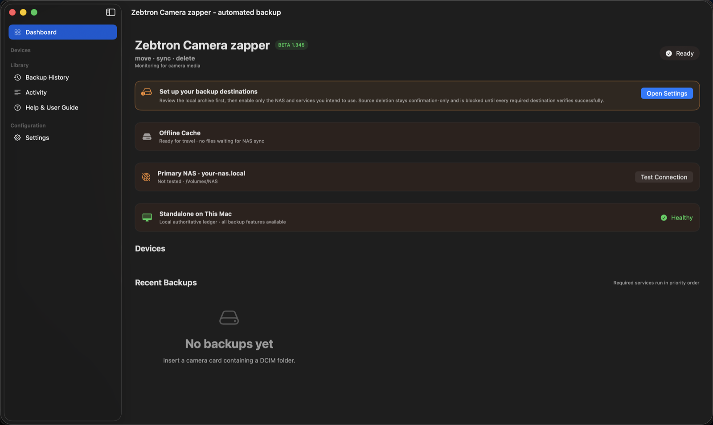

# Zebtron Camera Zapper User Manual

> Version 1.350 uses Flickr's canonical API endpoint for its live account check and suppresses raw OAuth diagnostics that could contain account tokens.

## What it does

Camera Zapper gives cameras and Android devices one auditable workflow: **move, sync, and delete**. Files are copied to interruption-safe local staging, SHA-256 verified, sent to enabled destinations in priority order, and recorded in durable receipts. Source deletion remains blocked until every required destination succeeds.

## First-run setup

The Setup Wizard opens automatically on a new installation and after an upgrade when setup is incomplete. It is also available through **Settings → Run Setup Again**.

1. Read the one-way workflow and privacy summary. Cloud uploads are private-only and Camera Zapper has no telemetry.
2. Confirm or choose the Local Device Archive. Press **Test** to create a temporary file, verify its SHA-256 after read-back, and remove it.
3. Select only the destinations you intend to use. Unselected services remain **Not set up**: they do not warn, nag, count as required, or block deletion.
4. For each chosen service, decide whether it must verify before originals may be deleted.
5. Configure and test only the chosen services. For NAS, mount the SMB share with macOS, choose its real folder, then test it. Google Photos authorization comes before YouTube because YouTube reuses the Google client.
6. Drag services into execution order. The local archive remains first.
7. Review the status summary and finish. Use noncritical media for the first complete test.

Service status has four meanings:

- **Not set up:** neutral and disabled; never an error or deletion gate.
- **Configuring:** setup is in progress and the app shows the next action.
- **Operational:** configuration passed its test.
- **Needs attention:** a previously chosen/configured service is now failing. It blocks deletion only when you explicitly marked it required.

You may skip the wizard. A gentle **Finish setup** card remains on the dashboard, and the wizard opens again on a later launch while setup is incomplete. Deletion stays **Always ask**; the wizard never enables automatic deletion.

## Everyday one-button workflow

For a connected device, use the large red **Sync All Locations & Delete** button. It scans the configured media folders, creates and SHA-256 verifies the local staging copy, runs every enabled service in priority order, verifies every service marked **Must succeed before deleting source**, and only then deletes confirmed originals from that device.

During the run, the device page identifies the active service and current filename/action. Each enabled destination is shown as queued, running, complete, or failed. **Show detailed activity** is enabled by default and displays timestamped file-level actions, receipt skips, provider pacing, uploads, verification, and errors. Turn it off when you want a quieter display; this changes presentation only.

After an interruption or failure, the primary action changes to **Resume Sync All Locations & Delete**. Resume reuses completed receipts, retries unfinished services, performs the complete deletion preflight again, and deletes nothing unless every required check passes.

1. Connect and unlock the camera, card, phone, or tablet.
2. Confirm the correct device is **Online**.
3. Press the large red **Sync, Verify & Safely Delete** button.
4. Confirm a newly discovered device when prompted.
5. Keep it connected while the app scans, stages, verifies, syncs, performs deletion preflight, and deletes eligible originals.
6. Read the final summary. Failed or blocked files remain on the source and in local staging.

The app resumes from receipts after a quit, disconnect, restart, or network failure.

## Back up or move your settings

Camera Zapper stores its live configuration outside the application bundle. Replacing the app during an upgrade does not intentionally remove this folder.

Settings location: `~/Library/Application Support/Zebtron Camera Zapper/`

It also maintains these recovery files:

- `Settings Backups/Camera-Zapper-Settings-Latest.json`
- one dated settings snapshot per day

Open **Settings → General → Settings portability** to:

- **Export Settings** before an upgrade or to configure another Mac.
- **Import Settings** from a previous export. The current configuration is backed up before replacement.
- **Show Automatic Backups** in Finder.

The export includes service selection, priority, deletion gates, destinations, accepted media, offline-cache rules, and coordination preferences. It never contains passwords, NAS credentials, API secrets, OAuth tokens, or Keychain records. After importing on another Mac, reauthorize Google Photos, private YouTube, and Flickr and verify machine-specific paths before the first run.

## Advanced controls

- **Scan & Preview** inventories without copying.
- **Start Verified Backup** stages and verifies sources.
- **Run Full Workflow** processes enabled services without final deletion.
- **Verify & Delete from Source** rechecks required receipts and removes eligible originals.
- Per-service **Catch Up** or **Resume** processes staged files for one destination.

## Services and priority

The first-run wizard is optional after initial setup. Open **Settings → Services & Priority** at any time and choose **Configure…** on an individual service. Google Photos exposes **Choose OAuth JSON / Reauthorize** and **Test Authorization** directly; Flickr and YouTube provide equivalent authorization controls. A service-specific dashboard error includes an **Open [Service] Settings** action so the repair path is never hidden.

Enabled services run top to bottom. Drag to reorder. **Must succeed before deleting source** makes a service a deletion gate.

- **Local Device Archive:** interruption-safe staging; retired after required durable services finish according to cache policy.
- **Primary NAS Archive:** copies and SHA-256 verifies on a volume mounted by macOS.
- **Google Photos:** uploads supported media at Google’s API-limited pace and creates a session/device album.
- **Apple Photos:** imports supported media into Photos.
- **Flickr:** uploads supported media privately and hidden; oversized files are logged and skipped.
- **NeoFinder:** catalogs verified destination files and may be required.
- **YouTube Video Backup:** uploads supported videos privately without notifying subscribers.

All cloud uploads are **private-only by design**. There is no in-app public visibility control.

## Current file-format support

Camera Zapper can discover, stage, hash, archive to local/NAS storage, and catalog these formats without changing the original:

- Photos: `.jpg`, `.jpeg`, `.heic`, `.heif`, `.png`, `.tif`, `.tiff`
- Camera RAW: `.arw`, `.raf`, `.cr2`, `.cr3`, `.nef`, `.nrw`, `.orf`, `.rw2`, `.dng`, `.gpr`
- Video: `.mp4`, `.mov`, `.m4v`, `.mkv`, `.avi`, `.mts`, `.m2ts`, `.3gp`, `.webm`

Destination APIs accept narrower sets:

- Google Photos and Apple Photos: JPG/JPEG, HEIC, PNG, GIF, TIFF, DNG, MOV, MP4, and M4V as currently implemented.
- Flickr: JPG/JPEG, PNG, GIF, TIFF, BMP, MOV, MP4, M4V, AVI, WMV, MPEG/MPG, 3GP, M2TS, OGG, and OGV, subject to Flickr limits (photos under 200 MB and videos under 1 GB; the app uses a small safety margin).

### Flickr connection and oversized files

Open **Settings -> Services & Priority -> Flickr -> Configure**. **Test Live Login** calls Flickr's `flickr.test.login` API and displays the connected account; it does not rely only on a saved local status flag. Use **Reconnect** to replace the complete API-key and access-token set, or **Disconnect** to remove Flickr credentials from Camera Zapper's Keychain vault.

API credentials and account tokens are committed together only after browser authorization finishes successfully. If authorization is cancelled, the prior complete credential set remains intact. An invalid or expired token changes Flickr to **Needs attention** and asks you to reconnect.

Files above Camera Zapper's Flickr safety margins (195 MB for a photo or 990 MB for a video) are listed and skipped before upload. When Flickr is optional, eligible files still complete and the service summary reports the skipped count. A skipped oversized file blocks source deletion only when Flickr is marked **Must succeed** and its media type is enabled for Flickr. NAS and YouTube receipts remain independent.
- YouTube: MOV, MP4, M4V, MKV, and AVI in the current adapter.
- NeoFinder and local/NAS archives operate on verified originals rather than a cloud codec list.

Optional compatibility processing creates an additional MP4 for supported video formats other than MP4 and MKV. MP4 and MKV are retained unchanged, and the original file is always preserved. A format being ingestible does not guarantee that every cloud provider will accept it; configure each service’s accepted media types accordingly.

## Offline travel

When a NAS/LAN is unavailable, verified media remains in the configured local cache. Catch-up resumes when the destination returns over LAN or VPN. Never manually remove pending cache content.

## Devices and history

Previously seen devices remain listed while offline with nickname, icon, facts, last-seen time, connection method, capacity, counts, and history. Sync controls stay disabled until reconnection.

## Safe deletion

Every file is preflighted again and needs receipts from all applicable required services. Inapplicable processors—such as transcoding an already-compatible MP4 or MKV—do not block deletion. A per-file error is logged and unrelated files continue where safe. Keep automatic deletion off until each device/destination has passed manual testing.

## Android troubleshooting

Camera Zapper uses Android Debug Bridge (ADB) to detect Android hardware, list media, calculate hashes on the source, copy data, and perform explicitly confirmed deletion. Install Android Platform Tools before first Android use. With Homebrew, run `brew install android-platform-tools`; Android Studio can install the same platform-tools package. Relaunch Camera Zapper afterward.

If a Galaxy Tab S7+ or another Android device is missing:

1. Unlock it and reconnect using a known data cable.
2. Set USB control to **This device** and USB use to **Transferring files**.
3. Confirm Developer options and USB debugging.
4. Accept the computer fingerprint and choose **Always allow**.
5. Choose **Probe Again**.
6. Run `adb devices -l`; state must be `device`, not `unauthorized` or `offline`.
7. If needed, run `adb kill-server`, reconnect, and probe again.

Dummy emulators such as a Nexus 4 are ignored unless they expose real user media. Revoke stale USB debugging authorizations if the fingerprint prompt never appears.

## Repeated Keychain prompts

Choose **Always Allow** for the correctly named app. Different ad-hoc builds can have different signing identities, causing repeat prompts; the public notarized build will use a stable identity.

## Public beta status

Version 1.350 is suitable for controlled beta testing, but the downloadable public build still needs stable Apple Developer ID signing, hardened-runtime review, notarization, and production OAuth/API review. Until those release gates are complete, macOS may show additional security prompts and testers should keep an independent backup.

## Support

- <https://zebtron.com/zapper/>
- <zapper@zebtron.com>
- <https://ko-fi.com/zebtron>

### Reporting a bug

Use **Report a Bug** in Help or About. The prefilled email asks for the app version, device model, connection method, steps to reproduce, expected result, and last visible error. Review anything you attach and remove passwords, API secrets, OAuth tokens, personal paths, and private filenames.

Camera Zapper is independently maintained in limited spare time. Every useful report is appreciated, but replies and fixes may take a while. Thank you for being patient.
