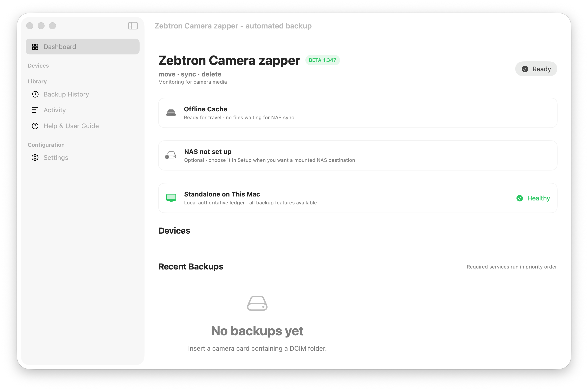

# Zebtron Camera Zapper

**Move · sync · delete** — verified, private photo & video backup for macOS.

Camera Zapper moves, verifies, syncs, and — only when you approve — **safely deletes** media from
cameras, SD cards, Android phones, tablets, and folders on your Mac. It stages every file locally,
verifies it with **SHA‑256**, runs your chosen destinations in priority order, and removes the
original only after every destination you mark *required* has a durable receipt.

Free for macOS · **[zebtron.com/zapper](https://zebtron.com/zapper/)** · made by [Zebtron](https://zebtron.com)

The app icon depicts Camera Zapper's one-way workflow: one camera sends media outward to generic cloud, local-disk, and NAS destinations. It intentionally contains no circular sync arrows or third-party service logos.



> ⚑ **Controlled beta (v1.347).** This is a hands‑on testing build and is **ad‑hoc signed** — on
> first launch, Control‑click the app and choose **Open**. It is *not* notarized yet, and cloud
> OAuth (Google / Flickr / YouTube) is still in review. Start with noncritical media and keep
> deletion confirmation on while you test.

## Features

- **One‑button workflow** — scan, verified backup, destination sync, preflight, and safe deletion.
- **SHA‑256 verification** with interruption‑safe local staging — nothing is deleted until it's provably copied.
- **Many destinations at once** — local archive, mounted **NAS (SMB)**, Apple Photos, Google Photos
  (session albums), Flickr, **private** YouTube, and NeoFinder.
- **Android, first‑class** — USB or wireless **ADB**, with guided troubleshooting. No iPhone required.
- **NAS catch‑up** after LAN or VPN reconnects — resumes where it left off.
- **Remembers your gear** — offline device history, nicknames, and sync status persist between runs.
- **Deduplication receipts**, multi‑Mac‑aware, so files never get copied twice.
- **Private by design** — cloud uploads are private‑only; the app never creates public/shared links.
- **No telemetry, no ads, no data sold.**

### Supported originals

JPEG, HEIC/HEIF, PNG, TIFF, major camera RAW (Sony ARW, Fujifilm RAF, Canon CR2/CR3, Nikon NEF/NRW,
Olympus ORF, Panasonic RW2, DNG, GoPro GPR) and video (MP4, MOV, M4V, MKV, AVI, MTS/M2TS, 3GP, WebM).
Cloud services accept provider‑specific subsets — see the
[user manual](Documentation/USER_MANUAL.md).

## Download

Grab the latest beta DMG from **[zebtron.com/zapper](https://zebtron.com/zapper/)**.

- **macOS 14+** (Apple Silicon or Intel)
- Open the DMG, drag **Zebtron Camera Zapper** to Applications, then **Control‑click → Open** the first time.
- For Android backup, install ADB: `brew install android-platform-tools`

Full steps: [Installation guide](Documentation/INSTALLATION.md).

## Build from source

Requires macOS 14+ and Xcode / Swift 6 tooling.

```bash
# run the tests
CLANG_MODULE_CACHE_PATH="$PWD/.build/module-cache" \
SWIFTPM_MODULECACHE_OVERRIDE="$PWD/.build/module-cache" \
swift test --disable-sandbox

# build the app bundle into dist/ (ad-hoc signed)
./build-app.sh
```

A public release additionally needs an Apple Developer ID signature and notarization.

## Privacy & data safety

- **Verified before delete.** Source deletion is confirmation‑only by default and stays blocked until
  every required destination verifies that exact file by hash.
- **Private‑only uploads.** YouTube uploads are private, Flickr uploads are private/hidden, and no
  shared Google Photos links are ever created.
- **Your credentials stay in Keychain.** OAuth tokens and service secrets are stored in the macOS
  Keychain and are intentionally excluded from source and distribution archives — never commit them.
- **No personal defaults.** Fresh installs start standalone with a local archive at
  `~/Pictures/Camera Zapper/Archive`; NAS and cloud services are disabled until you enable them.

App state lives under `~/Library/Application Support/Zebtron Camera Zapper/`.

## Documentation

- [Installation](Documentation/INSTALLATION.md)
- [User manual](Documentation/USER_MANUAL.md) · [PDF](Documentation/Zebtron-Camera-Zapper-1.347-User-Manual.pdf)
- [Developer handoff](Documentation/DEVELOPER_HANDOFF.md)

## Reporting bugs

Email **[zapper@zebtron.com](mailto:zapper@zebtron.com)** with the app version, macOS version,
source device model, connection method, steps to reproduce, expected result, and the last visible
error. Please remove passwords, API secrets, OAuth tokens, personal paths, and private filenames
before sending logs or screenshots.

Camera Zapper is independently maintained in limited spare time — every useful report is appreciated,
but replies and fixes may take a while. Thank you for your patience.

## Support

Camera Zapper is free and always will be. If it saves you time or a memory, you can
**[buy me a beer on Ko‑fi](https://ko-fi.com/zebtron)** 🍺 — it covers hosting and keeps the updates coming.

## License

[MIT](LICENSE) © 2026 Matthew Meyer (Zebtron)
